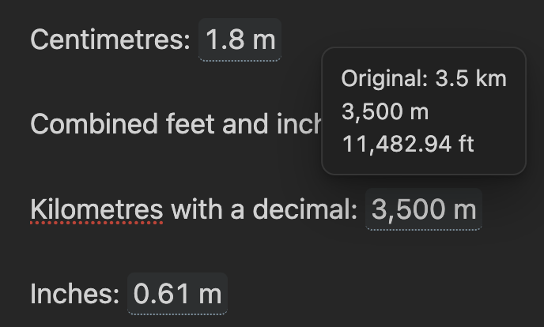
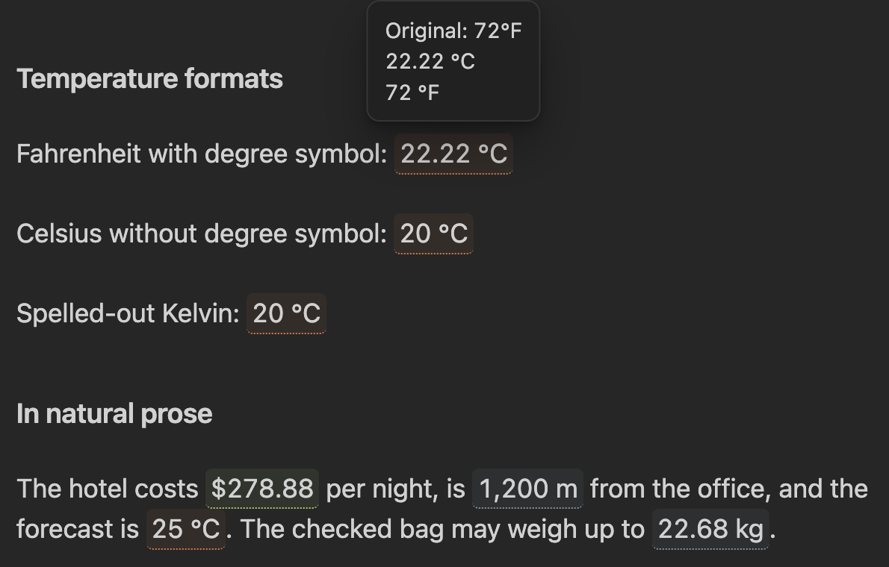

# Inline Conversions

Inline Conversions keeps original values in Markdown, shows
them in your preferred unit or currency, and reveals original and alternate
values on hover. Tap or focus a rendered value to open the same preview on
mobile and with a keyboard.

The plugin never accesses the network. Currency conversions are calculated from
a file in your vault that you own and update.

## Preview

### Length conversions



### Temperature and natural prose



## Syntax

Wrap an explicitly marked value in inline code:

```markdown
The service costs `cv: €1,200`.
The room is `cv: 18 ft` long.
The person is `cv: 5' 11"` tall and weighs `cv: 180 lb`.
Tomorrow will be `cv: 72°F`.
```

The marker defaults to `cv` and is configurable.

### Accepted value formats

- Currency symbol before or after: `€1,200`, `1 200 €`, `$99.50`, `500 ₽`
- ISO code before or after: `EUR 1,200`, `1.200,50 EUR`, `100 usd`
- Length: `12 mi`, `6 feet`, `180 cm`, `5' 11"`
- Mass: `2.5 kg`, `180 lb`, `12 ounces`
- Temperature: `72°F`, `20 C`, `293.15 kelvin`
- Number separators: `1,200.50`, `1.200,50`, `1 200,50`, `1'200.50`

Explicit markers prevent normal prose, dates, version numbers, and code from
being interpreted as measurements accidentally.

## Currency-rate file

The default is `Inline Conversions Rates.md`. Create a template with the command
**Inline Conversions: Create example currency rates file**, or write one yourself:

```markdown
---
base: USD
updated: 2026-09-06
source: Manual rate snapshot
rates:
  USD: 1
  EUR: 0.86
  RUB: 80.00
  GBP: 0.75
  GEL: 2.70
---
```

Each rate means units of that currency per one base currency. Inline Conversions also
accepts equivalent JSON and `currency,rate` CSV files. It automatically reloads
the configured file when it changes.

## Settings

Defaults are:

- Primary currency: USD; hover: USD and RUB
- Primary length: m; hover: m and ft
- Primary mass: kg; hover: kg and lb
- Primary temperature: °C; hover: °C and °F
- Original input included in the preview

## Development

```bash
npm install
npm run check
```

Copy `main.js`, `manifest.json`, and `styles.css` to:

```text
<vault>/.obsidian/plugins/inline-conversions/
```

Reload Obsidian, then enable **Inline Conversions** under Community plugins.
